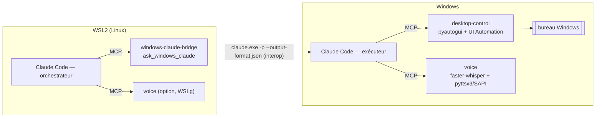

# Architecture d'ensemble

`mcp-desktop-control` regroupe trois serveurs MCP (+ une boucle vocale) qui
permettent à un agent (Claude Code) de **percevoir et agir** sur une machine —
écran, souris/clavier, voix — et de **déléguer** d'un environnement à l'autre.

## Composants

| Composant | Fichiers | Outils MCP | S'exécute |
|---|---|---|---|
| **desktop-control** | `server.py`, `backends.py` | `screenshot`, `mouse_move`, `click`, `double_click`, `right_click`, `drag`, `scroll`, `type_text`, `press_key`, `hotkey`, `ui_tree`, `ui_click` | Windows, macOS ou Linux (X11/Wayland) |
| **voice** | `voice/server.py`, `voice/voice_core.py` | `speak`, `listen`, `transcribe_file` | offline (Windows/Linux/WSLg) |
| **windows-claude-bridge** | `bridge/server.py` | `ask_windows_claude` | WSL2/Linux |
| **voice loop** *(hors MCP)* | `voice/loop.py` | — (wrapper mains-libres) | autonome |

## A. Vue composants

```
                         ┌──────────────────────────── agent (Claude Code) ───────────────────────────┐
                         │                                                                             │
                         │   appelle des OUTILS MCP                                                     │
                         └───────┬───────────────────────┬───────────────────────────┬────────────────┘
                                 │                       │                           │
                     ┌───────────▼─────────┐  ┌──────────▼──────────┐    ┌───────────▼─────────────┐
                     │   desktop-control    │  │        voice         │    │  windows-claude-bridge   │
                     │  perception + action │  │   parler / écouter   │    │  déléguer à un autre     │
                     ├──────────────────────┤  ├──────────────────────┤    │  Claude (Windows)        │
                     │ screenshot, click,   │  │ speak, listen,       │    ├──────────────────────────┤
                     │ type, scroll, drag,  │  │ transcribe_file      │    │ ask_windows_claude       │
                     │ ui_tree, ui_click    │  │                      │    │                          │
                     └──────────┬───────────┘  └──────────┬───────────┘    └──────────┬───────────────┘
                                │                          │                           │
                  pyautogui + UIA(Win)/AT-SPI    faster-whisper (STT)        claude.exe -p --output-format
                  mss/grim/ydotool (Linux)       pyttsx3/espeak/Piper(TTS)   json  (WSL interop)
                                │                          │
                                ▼                          ▼
                        écran + souris/clavier        haut-parleurs + micro
```

## B. Topologie recommandée — orchestrateur WSL2 + exécuteur Windows

WSL2 ne voit pas le bureau Windows : il **orchestre**, et un Claude **Windows**
**exécute** le travail bureau/voix.

```
            WSL2 (Linux)                       │                    Windows
                                               │
 ┌───────────────────────────────────────┐    │   ┌────────────────────────────────────────┐
 │     Claude Code — orchestrateur         │   │   │       Claude Code — exécuteur            │
 │                                         │   │   │                                          │
 │  client MCP                             │   │   │  client MCP                              │
 │   ├─▶ windows-claude-bridge ────────────┼── claude.exe ──┼──▶ (run headless -p --json)       │
 │   │      (bridge/server.py)             │  (interop) │   │     ├─▶ desktop-control           │
 │   │                                     │   │   │     │     │     pyautogui + UI Automation │
 │   └─▶ voice (option, audio WSLg)         │   │   │     │     │        └─▶ bureau Windows      │
 │          speak / listen                 │   │   │     └─▶ voice  speak / listen             │
 └───────────────────────────────────────┘    │   │            faster-whisper + SAPI/pyttsx3  │
                                               │   └────────────────────────────────────────┘
```



## C. Topologie mono-machine

Un seul poste (Windows, ou Linux/X11) : l'agent et les serveurs sont locaux,
pas de pont nécessaire.

```
┌──────────── une machine (Windows ou Linux/X11) ────────────┐
│  Claude Code                                                │
│    ├─▶ desktop-control  ─▶ écran + souris/clavier + a11y     │
│    └─▶ voice            ─▶ haut-parleurs + micro             │
└─────────────────────────────────────────────────────────────┘
```

## D. Boucle vocale mains-libres (`voice/loop.py`)

Enveloppe l'agent : tout est local **sauf** l'appel à l'agent.

```
  micro ─▶ mot d'activation ─▶ enregistrement ─▶ STT (whisper)
                                                     │
                                                     ▼
   haut-parleurs ◀─ TTS ◀─ réponse ◀─ agent (claude -p)  [ ◀─ peut piloter desktop-control / bridge ]
```

## Quelle doc pour quoi
- `README.md` — installation & usage, par composant.
- `DESIGN.md` — étude de faisabilité + conception (perception→action, backends).
- `WSL2.md` — déploiement WSL2 (schéma B, configs `.mcp.json`, voix sous WSLg).
- `voice/README.md`, `bridge/README.md` — détails des sous-modules.
- `mcp.json.example` — blocs de configuration prêts pour Claude Code.
